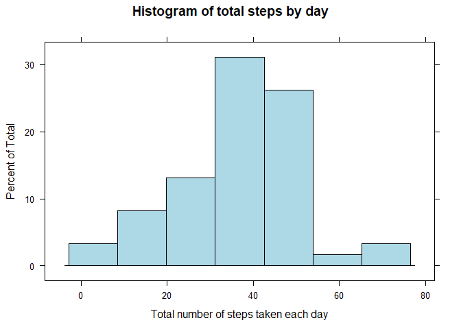
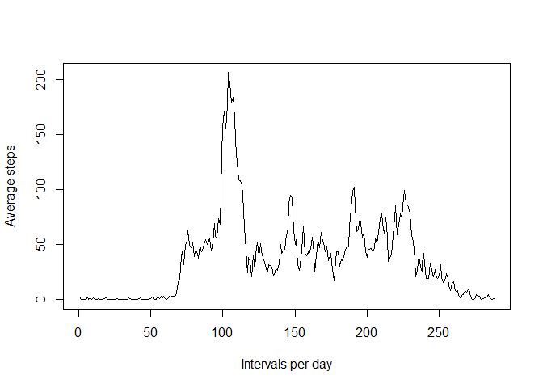
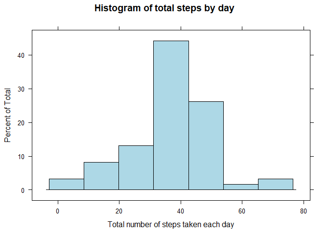
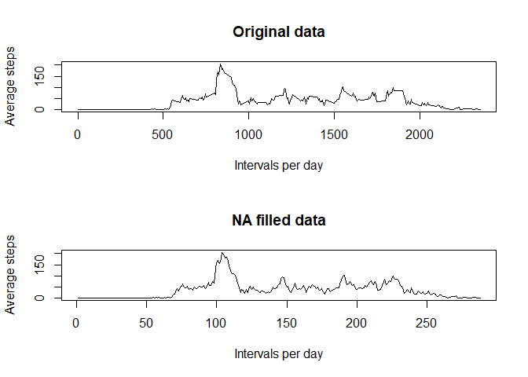
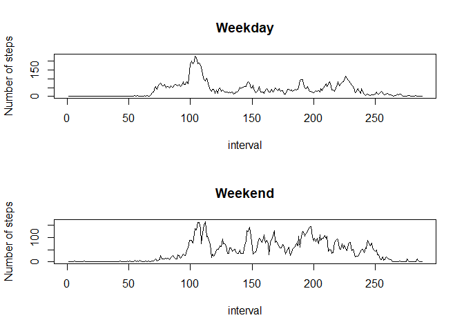

\#Download the data

    library("data.table")

    ## Warning: package 'data.table' was built under R version 3.6.3

    Url<-"https://d396qusza40orc.cloudfront.net/repdata%2Fdata%2Factivity.zip"
    download.file(Url,destfile=paste0(getwd(), '/repdata%2Fdata%2Factivity.zip'),method="curl")
    unzip("repdata%2Fdata%2Factivity.zip",exdir="data")

\#Reading the data

    Datos<-read.csv("activity.csv")
    DatosNA<-Datos[!is.na(Datos$steps),]

\#What is mean total number of steps taken per day? \#1.Calculate the
total number of steps taken per day

    numberofsteps<-tapply(DatosNA$steps,DatosNA$date,mean)
    as.data.frame(numberofsteps)

    ##            numberofsteps
    ## 2012-10-01            NA
    ## 2012-10-02     0.4375000
    ## 2012-10-03    39.4166667
    ## 2012-10-04    42.0694444
    ## 2012-10-05    46.1597222
    ## 2012-10-06    53.5416667
    ## 2012-10-07    38.2465278
    ## 2012-10-08            NA
    ## 2012-10-09    44.4826389
    ## 2012-10-10    34.3750000
    ## 2012-10-11    35.7777778
    ## 2012-10-12    60.3541667
    ## 2012-10-13    43.1458333
    ## 2012-10-14    52.4236111
    ## 2012-10-15    35.2048611
    ## 2012-10-16    52.3750000
    ## 2012-10-17    46.7083333
    ## 2012-10-18    34.9166667
    ## 2012-10-19    41.0729167
    ## 2012-10-20    36.0937500
    ## 2012-10-21    30.6284722
    ## 2012-10-22    46.7361111
    ## 2012-10-23    30.9652778
    ## 2012-10-24    29.0104167
    ## 2012-10-25     8.6527778
    ## 2012-10-26    23.5347222
    ## 2012-10-27    35.1354167
    ## 2012-10-28    39.7847222
    ## 2012-10-29    17.4236111
    ## 2012-10-30    34.0937500
    ## 2012-10-31    53.5208333
    ## 2012-11-01            NA
    ## 2012-11-02    36.8055556
    ## 2012-11-03    36.7048611
    ## 2012-11-04            NA
    ## 2012-11-05    36.2465278
    ## 2012-11-06    28.9375000
    ## 2012-11-07    44.7326389
    ## 2012-11-08    11.1770833
    ## 2012-11-09            NA
    ## 2012-11-10            NA
    ## 2012-11-11    43.7777778
    ## 2012-11-12    37.3784722
    ## 2012-11-13    25.4722222
    ## 2012-11-14            NA
    ## 2012-11-15     0.1423611
    ## 2012-11-16    18.8923611
    ## 2012-11-17    49.7881944
    ## 2012-11-18    52.4652778
    ## 2012-11-19    30.6979167
    ## 2012-11-20    15.5277778
    ## 2012-11-21    44.3993056
    ## 2012-11-22    70.9270833
    ## 2012-11-23    73.5902778
    ## 2012-11-24    50.2708333
    ## 2012-11-25    41.0902778
    ## 2012-11-26    38.7569444
    ## 2012-11-27    47.3819444
    ## 2012-11-28    35.3576389
    ## 2012-11-29    24.4687500
    ## 2012-11-30            NA

\#2. If you do not understand the difference between a histogram \#and a
barplot, research the difference between them. \#Make a histogram of the
total number of steps taken each day.

    library(lattice)
    histogram(numberofsteps,col="lightblue",xlab="Total number of steps taken each day",main="Histogram of total steps by day")

 \#3
Calculate and report the mean and median of the total number of \#steps
taken per day

    tapply(DatosNA$steps,DatosNA$date,mean)->meannumsteps
    tapply(DatosNA$steps,DatosNA$date,median)->mediannumsteps

\#What is the average daily activity pattern? \#1. Make a time series
plot (i.e. type = “l”) of the 5-minute interval (x-axis) and the average
number of steps taken, averaged across all days (y-axis)

    DatosNA$steps<-na.omit(DatosNA$steps)
    tapply(DatosNA$steps,DatosNA$interval,mean)->meantepsbyinterval
    plot(meantepsbyinterval,type="l",xlab="Intervals per day",ylab="Average steps")

\#2. Which 5-minute interval, on average across all the days in the
dataset, contains the maximum number of steps?

    summ<-max(meantepsbyinterval)
    which(meantepsbyinterval==summ)

    ## 835 
    ## 104

\#Imputing missing values \#1.Calculate and report the total number of
missing values in the dataset (i.e. the total number of rows with NAs)

    sum(is.na(Datos))

\#Devise a strategy for filling in all of the missing values in the
dataset. The strategy does not need to be sophisticated. For example,
you could use the mean/median for that day, or the mean for that
5-minute interval, etc.

    print("The the values of the missing values were filled with the mean of 5-minute interval")

    ## [1] "The the values of the missing values were filled with the mean of 5-minute interval"

\#Create a new dataset that is equal to the original dataset but with
the missing data filled in.

    as.data.frame(meantepsbyinterval)->meantepsbyinterval
    InterVal<-head(Datos$interval,288)
    meantepsbyinterval<-cbind(InterVal,meantepsbyinterval)
    colnames(meantepsbyinterval)<-c("min","means")
    dataNA<-function(Datos,meantepsbyinterval)
    {
      DataNAs<-Datos
        for(i in 1:nrow(DataNAs))
        {
           if(is.na(DataNAs[i,"steps"]))
           {
              interval<-DataNAs[i,"interval"]
              DataNAs[i,"steps"]=meantepsbyinterval[which(meantepsbyinterval$min==interval),"means"]
           }
        }
    DataNAs
    }
    dataNAs<-dataNA(Datos,meantepsbyinterval)

\#Make a histogram of the total number of steps taken each day and
Calculate and report the mean and median total number of steps taken per
day. Do these values differ from the estimates from the first part of
the assignment? What is the impact of imputing missing data on the
estimates of the total daily number of steps? \#The impact of imputing
missing data is shown in the graph and you can see how the NA filled
data is more defined.

    numberofsteps2<-tapply(dataNAs$steps,dataNAs$date,mean)
    histogram(numberofsteps2,col="lightblue",xlab="Total number of steps taken each day",main="Histogram of total steps by day")

    tapply(dataNAs$steps,dataNAs$date,mean)->meannumsteps2
    tapply(dataNAs$steps,dataNAs$date,median)->mediannumsteps2
    tapply(dataNAs$steps,dataNAs$interval,mean)->meantepsbyinterval3
    par(mfrow=c(2,1))
    plot(meantepsbyinterval,type="l",xlab="Intervals per day",ylab="Average steps",main="Original data")
    plot(meantepsbyinterval3,type="l",xlab="Intervals per day",ylab="Average steps",main="NA filled data")

\#Create a new factor variable in the dataset with two levels –
“weekday” and “weekend” indicating whether a given date is a weekday or
weekend day.

    Sys.setlocale("LC_TIME", "English")

    ## [1] "English_United States.1252"

    weekdayss<-c("Monday","Tuesday","Wednesday","Thursday","Friday")
    dataNAs$date<-as.Date(dataNAs$date)
    dataNAs$weekday<-factor((weekdays(dataNAs$date) %in% weekdayss),levels=c(FALSE,TRUE),labels=c("weekend","weekday")) 
    unique(dataNAs$weekday)

    ## [1] weekday weekend
    ## Levels: weekend weekday

    head(dataNAs)

    ##       steps       date interval weekday
    ## 1 1.7169811 2012-10-01        0 weekday
    ## 2 0.3396226 2012-10-01        5 weekday
    ## 3 0.1320755 2012-10-01       10 weekday
    ## 4 0.1509434 2012-10-01       15 weekday
    ## 5 0.0754717 2012-10-01       20 weekday
    ## 6 2.0943396 2012-10-01       25 weekday

\#Make a panel plot containing a time series plot (i.e. type = “l”) of
the 5-minute interval (x-axis) and the average number of steps taken,
averaged across all weekday days or weekend days (y-axis). See the
README file in the GitHub repository to see an example of what this plot
should look like using simulated data.

    weekDayDatos<-dataNAs[which(dataNAs$weekday=="weekday"),]
    weekendDatos<-dataNAs[which(dataNAs$weekday=="weekend"),]
    meanweekday<-tapply(weekDayDatos$steps,weekDayDatos$interval,mean)
    meanweekend<-tapply(weekendDatos$steps,weekendDatos$interval,mean)
    par(mfrow=c(2,1))
    plot(meanweekday,main="Weekday",xlab="interval",ylab="Number of steps",type="l")
    plot(meanweekend,main="Weekend",xlab="interval",ylab="Number of steps",type="l")

